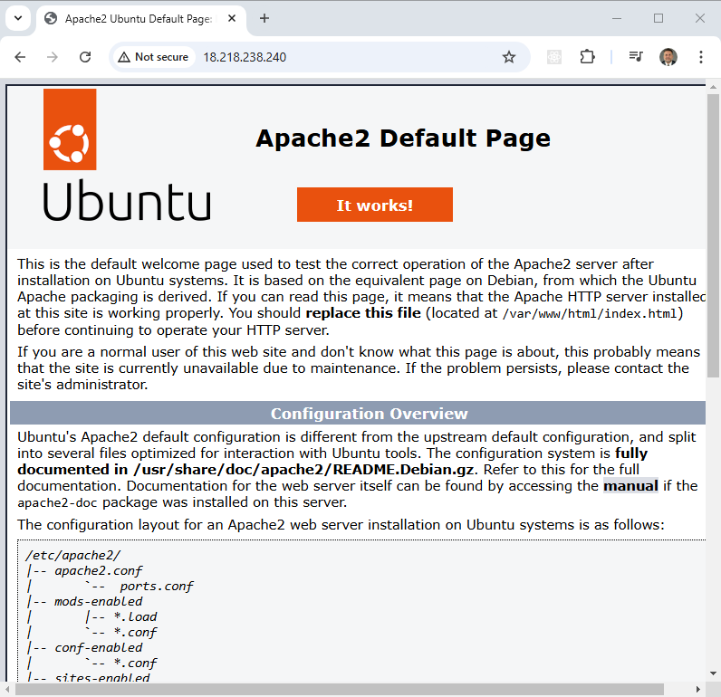

Azure Terraform Setup Instructions
=========================================

This project complements a video on my channel that demonstrates how to configure Terraform with Azure.

The Terraform configuration in this project creates a minimal virtual network (VNet) with a single public subnet.

An Ubuntu virtual machine (VM) is deployed, and a custom_data](scripts/custom_data.sh) script is used to install Apache during the instance's boot process.

## Prerequisites

* [Install AZ CLI](https://learn.microsoft.com/en-us/cli/azure/install-azure-cli) 
* [Install Latest Terraform](https://developer.hashicorp.com/terraform/install)
* [Install Latest Packer](https://developer.hashicorp.com/packer/install)

NOTE: Make sure the az, packer and terraform commands are all in your $PATH.

The [check_env](./check_env.sh) script will validate this is set correctly when you run the terraform build.

## Azure Account

To run this example you need an [Azure account](https://azure.microsoft.com/en-us/pricing/purchase-options/azure-account/). 
You will need to upgrade to "Pay as you go" for all my terraform examples to work properly. With the free option you may be locked out of certain services in certain regions which is hard to predict.

## Get your ARM_SUBSCRIPTION_ID

### 1. **Log in to Azure Portal**
   - Go to the [Azure Portal](https://portal.azure.com/) and log in with your credentials.

### 2. **Navigate to Subscriptions**
   - In the left-hand navigation pane, select **Subscriptions**.
   - If you don't see it, use the search bar at the top and search for "Subscriptions."

### 3. **View Subscription List**
   - You will see a list of all subscriptions associated with your account.

### 4. **Find the Subscription ID**
   - Each subscription will have a corresponding **Subscription ID** listed in the table.
   - If there are multiple subscriptions, locate the one you want and copy its ID.

## Get your ARM_TENANT_ID

The tenant id specifies which active directory you will be using. If you are just starting out you will likely be using the default active directory tenant.

### 1. **Log in to Azure Portal**
   - Visit the [Azure Portal](https://portal.azure.com/) and log in with your credentials.

### 2. **Navigate to Azure Active Directory**
   - In the left-hand navigation pane, select **Azure Active Directory**.
   - If it’s not visible, use the search bar at the top and search for "Azure Active Directory."

### 3. **View the Tenant Information**
   - Once on the **Azure Active Directory** overview page, you will see details about your directory.
   - The **Tenant ID** is listed under the **Basic Information** section, typically along with:
     - **Tenant name**
     - **Primary domain**

### 4. **Copy the Tenant ID**
   - Locate the **Tenant ID** field and click the **copy icon** next to it to copy it to your clipboard.

## Create the Service Prinicpal

To set up a system account for Terraform, you need to create a **Service Principal** in Azure. Below are the steps:


### **1. Log in to Azure**
   - Log in to the [Azure Portal](https://portal.azure.com/).

### **2. Open Azure Active Directory**
   - In the left-hand navigation pane, select **Azure Active Directory**.
   - If you don’t see it, use the search bar at the top to search for "Azure Active Directory."

### **3. Navigate to App Registrations**
   - In the **Azure Active Directory** blade, select **App Registrations**.
   - Click **+ New Registration** to create a new system account.

### **4. Register the System Account**
   - Fill in the required details:
     - **Name**: Choose a descriptive name for the system account (e.g., `Terraform-SP`).
     - **Supported Account Types**: Keep the default "Accounts in this organizational directory only."
     - **Redirect URI**: Leave this blank unless you are configuring authentication for a web app.
   - Click **Register**.

### **5. Create a Client Secret**
   - Once the app is registered, navigate to the **Certificates & Secrets** section.
   - Under **Client Secrets**, click **+ New Client Secret**.
   - Enter a description (e.g., `Terraform Key`) and select an expiration period.
   - Click **Add**.
   - **Copy the generated value** immediately as you won't be able to view it again.

### **6. Assign Roles to the Service Principal**
   - Go to the **Subscriptions** blade.
   - Select the subscription where Terraform will manage resources.
   - Click **Access Control (IAM)** in the left-hand menu.
   - Click **+ Add Role Assignment**.
   - Assign the appropriate role (e.g., **Contributor** or **Owner** for broader permissions).
   - In the **Assign Access To** field, select **Azure AD user, group, or service principal**.
   - Search for the registered service principal (e.g., `Terraform-SP`) and select it.
   - Click **Save**.
### **7. Note Down Required Details**
   You will need the following details for your Terraform configuration:
   - **Subscription ID**: Found in the Subscription details page.
   - **Tenant ID**: Found in Azure Active Directory → **Overview**.
   - **Client ID**: Found in the registered app under **Overview**.
   - **Client Secret**: Generated in step 5.

## Set Environment Variables

Here are examples of how to set the required Azure Resource Manager (ARM) environment variables for Terraform in **Bash** and **PowerShell**.

### Bash Example
```bash
# Set the Azure Subscription ID
export ARM_SUBSCRIPTION_ID="your-subscription-id"

# Set the Azure Client ID (Service Principal Application ID)
export ARM_CLIENT_ID="your-client-id"

# Set the Azure Client Secret (Service Principal Key)
export ARM_CLIENT_SECRET="your-client-secret"

# Set the Azure Tenant ID
export ARM_TENANT_ID="your-tenant-id"
```

### Powershell Example

```powershell
# Set the Azure Subscription ID
$env:ARM_SUBSCRIPTION_ID = "your-subscription-id"

# Set the Azure Client ID (Service Principal Application ID)
$env:ARM_CLIENT_ID = "your-client-id"

# Set the Azure Client Secret (Service Principal Key)
$env:ARM_CLIENT_SECRET = "your-client-secret"

# Set the Azure Tenant ID
$env:ARM_TENANT_ID = "your-tenant-id"
```

## Run the "apply" script

```bash
~/azure-setup$ ./apply.sh
NOTE: Validating that required commands are found in your PATH.
NOTE: az is found in the current PATH.
NOTE: packer is found in the current PATH.
NOTE: terraform is found in the current PATH.
NOTE: All required commands are available.
NOTE: Validating that required environment variables are set.
NOTE: ARM_CLIENT_ID is set.
NOTE: ARM_CLIENT_SECRET is set.
NOTE: ARM_SUBSCRIPTION_ID is set.
NOTE: ARM_TENANT_ID is set.
NOTE: All required environment variables are set.
NOTE: Logging in to Azure using Service Principal...
NOTE: Successfully logged into Azure.
Initializing the backend...
Initializing provider plugins...
- Finding latest version of hashicorp/azurerm...
- Installing hashicorp/azurerm v4.14.0...
- Installed hashicorp/azurerm v4.14.0 (signed by HashiCorp)
Terraform has created a lock file .terraform.lock.hcl to record the provider
selections it made above. Include this file in your version control repository
so that Terraform can guarantee to make the same selections by default when
you run "terraform init" in the future.

Terraform has been successfully initialized!

You may now begin working with Terraform. Try running "terraform plan" to see
any changes that are required for your infrastructure. All Terraform commands
should now work.

If you ever set or change modules or backend configuration for Terraform,
rerun this command to reinitialize your working directory. If you forget, other
commands will detect it and remind you to do so if necessary.
data.azurerm_client_config.current: Reading...
data.azurerm_subscription.primary: Reading...
[...]
```

## Test the build

Once built a VM called `setup-vm` will be created in the `setup-resource-group` and will be publicly available. The output of the terraform will be the public FQDN.

You can `SSH` to that instance with the "[Private_Key](keys\Private_Key)".

You can also open a web browser and see that apache has been deployed - This can take up to 5 minutes to initialize.



## Run the "destroy" script when you are done

```bash
~/azure-setup$ ./destroy.sh
Initializing the backend...
Initializing provider plugins...
- Reusing previous version of hashicorp/azurerm from the dependency lock file
- Using previously-installed hashicorp/azurerm v4.14.0

Terraform has been successfully initialized!

You may now begin working with Terraform. Try running "terraform plan" to see
any changes that are required for your infrastructure. All Terraform commands
should now work.

If you ever set or change modules or backend configuration for Terraform,
rerun this command to reinitialize your working directory. If you forget, other
commands will detect it and remind you to do so if necessary.
data.azurerm_client_config.current: Reading...
azurerm_resource_group.setup: Refreshing state... [id=/subscriptions/e4dee2a9-14a7-42fd-a86f-11428698a6a3/resourceGroups/setup-resource-group]
data.azurerm_subscription.primary: Reading...
[...]
```
